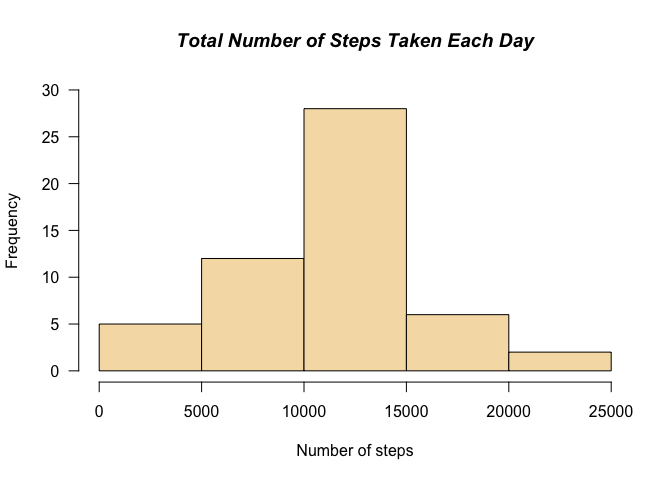
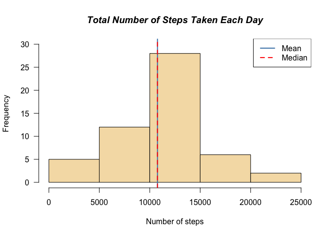
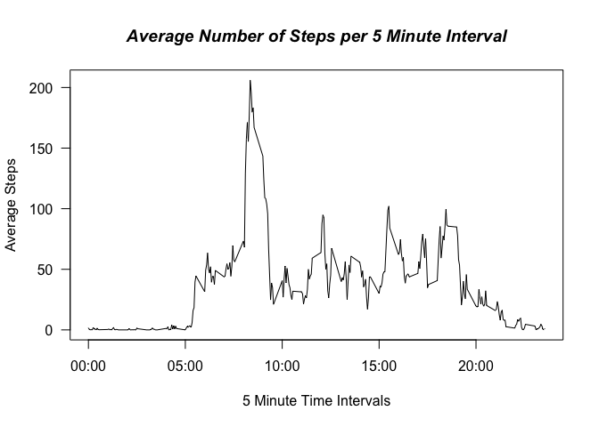
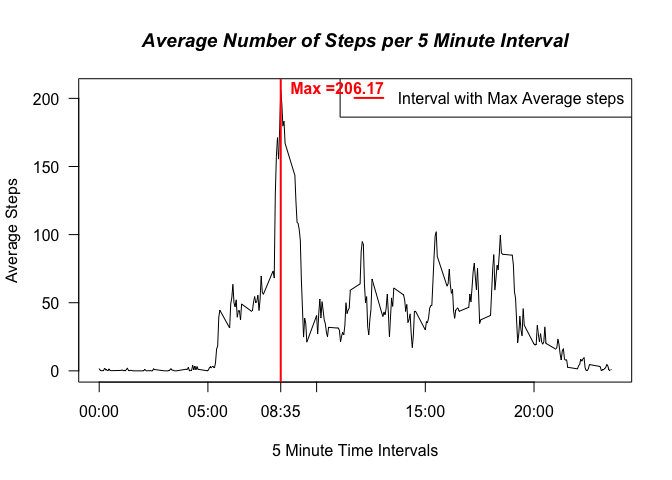
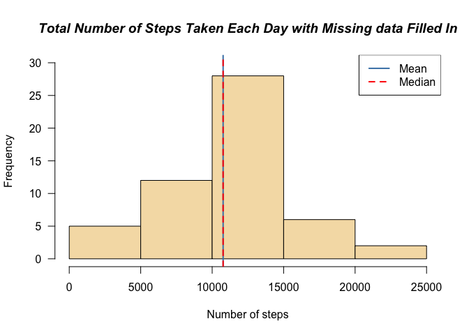
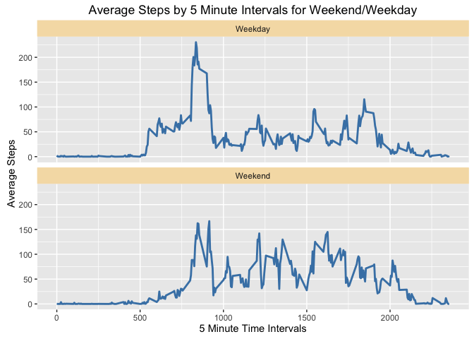

# Reproducible Research: Peer Assessment 1


## Loading and preprocessing the data

### 1. Load the data

```r
data<-read.csv("activity.csv")
```

### 2. Process/transform the data 

```r
cleanData<-subset(data,complete.cases(data))
```

## What is mean total number of steps taken per day?

```r
Total_Daily<-aggregate(cleanData$steps,
                       list(date =cleanData$date),
                       sum)
```
### 1. Make a histogram of the total number of steps taken each day

```r
hist(Total_Daily$x,
     main=NULL,
     xlab="Number of steps",
     col="wheat",
     ylim = c(0,30),
     las=1)
title(main = "Total Number of Steps Taken Each Day",
      font.main=4)
```

<!-- -->

### 2. Calculate and report the mean and median total number of steps taken per day

```r
Total_Daily_mean <-mean(Total_Daily $x)
Total_Daily_median <-median(Total_Daily$x)
hist(Total_Daily $x,
     main=NULL,
     xlab="Number of steps",
     col="wheat",
     ylim = c(0,30),
     las=1)
abline(v= Total_Daily_mean,
       col="steelblue",
       lwd=2,
       lty = 1)
abline(v= Total_Daily_median,
       col="red",
       lwd=2,
       lty=2)
legend("topright",
       c("Mean", "Median"), 
       lty=c(1,2), 
       col=c("steelblue", "red"), 
       lwd=2)
title(main = "Total Number of Steps Taken Each Day",
      font.main=4)
```

<!-- -->

## What is the average daily activity pattern?
### 1. Make a time series plot of the 5-minute interval (x-axis) and the average number of steps taken, averaged across all days (y-axis)


```r
dailymean<-aggregate(cleanData$steps,
                    list(interval =cleanData$interval) ,
                     mean)

dailymean$HHMM<-format(as.POSIXct("2012-10-01", format= "%Y-%m-%d") +
                       (floor(dailymean$interval / 100)*60*60)+
                       ((dailymean$interval %% 100)*60), "%H:%M")
plot(x =dailymean$interval ,
     y=dailymean$x, 
     main=NULL,
     type = "l",
     xlab = "5 Minute Time Intervals",
     xaxt= "n",
     ylab = "Average Steps",
     las=1)
xLabels<-seq(0,2000,500)
axis(1,at=xLabels,labels = dailymean[dailymean$interval %in% xLabels,]$HHMM)
title(main = "Average Number of Steps per 5 Minute Interval",
      font.main=4)
```

<!-- -->

### 2. Which 5-minute interval, on average across all the days in the dataset, contains the maximum number of steps?


```r
maxAverage<-max(dailymean$x)
intervalWithMax<-dailymean[maxAverage==dailymean$x,]$interval

plot(x =dailymean$interval ,
     y=dailymean$x, 
     main=NULL,
     type = "l",
     xlab = "5 Minute Time Intervals",
     xaxt= "n",
     ylab = "Average Steps",
     #xlim = c(0000,2355),
     las=1)
xlabels<-c(seq(0,2000,500),intervalWithMax)
xlabels<-xlabels[order(xlabels)]
axis(1,at=xlabels,labels = dailymean[dailymean$interval %in% xlabels,]$HHMM)
abline(v=dailymean[max(dailymean$x)==dailymean$x,]$interval,
       col="red",
       lwd=2)
legend("topright",
       "Interval with Max Average steps", 
       lty=1, 
       col= "red",
       lwd=2)
title(main = "Average Number of Steps per 5 Minute Interval",
      font.main=4)
text(intervalWithMax,
     maxAverage,
     labels=paste0("Max =",toString(round(maxAverage,2))),
     col = "red",
     font = 2,
     pos = 4)
```

<!-- -->


## Imputing missing values
### 1. Calculate and report the total number of missing values in the dataset 


```r
 narowcount<-length(data$steps[is.na(data$steps)])
```
### 2. Devise a strategy for filling in all of the missing values in the dataset. 


```r
MissingData<-data[is.na(data$steps),]
naMapfill<-merge(MissingData,dailymean,by.x="interval",by.y ="interval")
```

### 3.Create a new dataset that is equal to the original dataset but with the missing data filled in.


```r
 naMapfill$steps<-naMapfill$x
 
 NewData<-rbind(cleanData[c("steps","date","interval")],
                     naMapfill[c("steps","date","interval")])
```

### 4. Make a histogram of the total number of steps taken each day and Calculate and report the mean and median total number of steps taken per day. 

```r
Total_Daily_New<-aggregate(NewData$steps,
                       list(date =NewData$date),
                       sum)

Total_Daily_New_mean <-mean(Total_Daily_New$x)
Total_Daily_New_median <-median(Total_Daily_New$x)
hist(Total_Daily$x,
     main= NULL,
     xlab="Number of steps",
     col="wheat",
     ylim = c(0,30),
     las=1)
abline(v=Total_Daily_New_mean,
       col="steelblue",
       lwd=2,
       lty = 1)
abline(v=Total_Daily_New_median,
       col="red",
       lwd=2,
       lty=2)
legend("topright",
       c("Mean", "Median"), 
       lty=c(1,2), 
       col=c("steelblue", "red"), 
       lwd=2)
title(main ="Total Number of Steps Taken Each Day with Missing data Filled In",
      font.main=4)
```

<!-- -->

### 4a. Do these values differ from the estimates from the first part of the assignment? 
** No, there is no difference.

### 4b. What is the impact of imputing missing data on the estimates of the total daily number of steps?
** No impact is seen.

## Are there differences in activity patterns between weekdays and weekends?

### 1. Create a new factor variable in the dataset with two levels -- "weekday" and "weekend" indicating whether a given date is a weekday or weekend day.


```r
NewData$week<-weekdays(as.POSIXct(NewData$date, format ="%Y-%m-%d"))
NewData$week[NewData$week %in% c("Saturday","Sunday")]<-"Weekend"
NewData$week[NewData$week != "Weekend"]<-"Weekday"
```

### 2. Make a panel plot containing a time series plot of the 5-minute interval (x-axis) and the average number of steps taken, averaged across all weekday days or weekend days (y-axis). 

```r
weekdata<-aggregate(NewData$steps,
          list(interval=NewData$interval,
               week = NewData$week),
        mean)
```


```r
library(ggplot2)
g<-ggplot(weekdata,aes(interval,x))
g<-g+geom_line(col = "steelblue",lwd=1) 
g<-g+facet_wrap(~week,ncol=1)
g<-g+labs(x ="5 Minute Time Intervals")
g<-g+labs(y="Average Steps")
g<-g+labs(title="Average Steps by 5 Minute Intervals for Weekend/Weekday", font=4)
g<-g+theme(strip.background = element_rect(colour = "wheat",
                                           fill = "wheat",size = 3))
print(g)
```

<!-- -->
